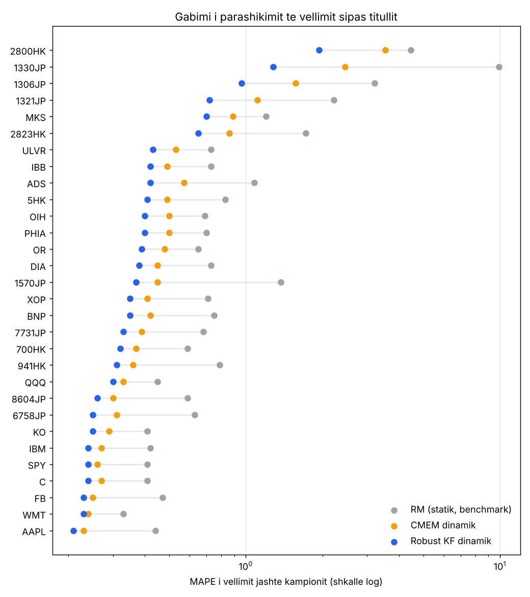
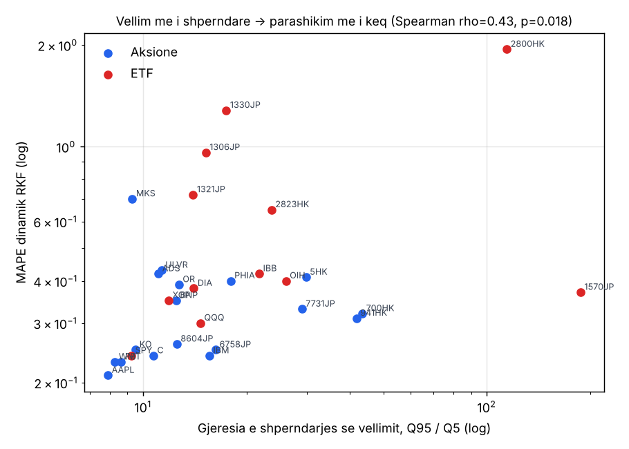
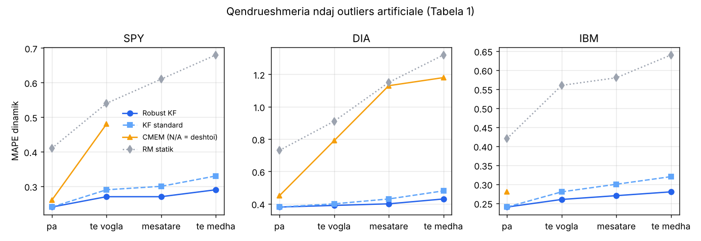
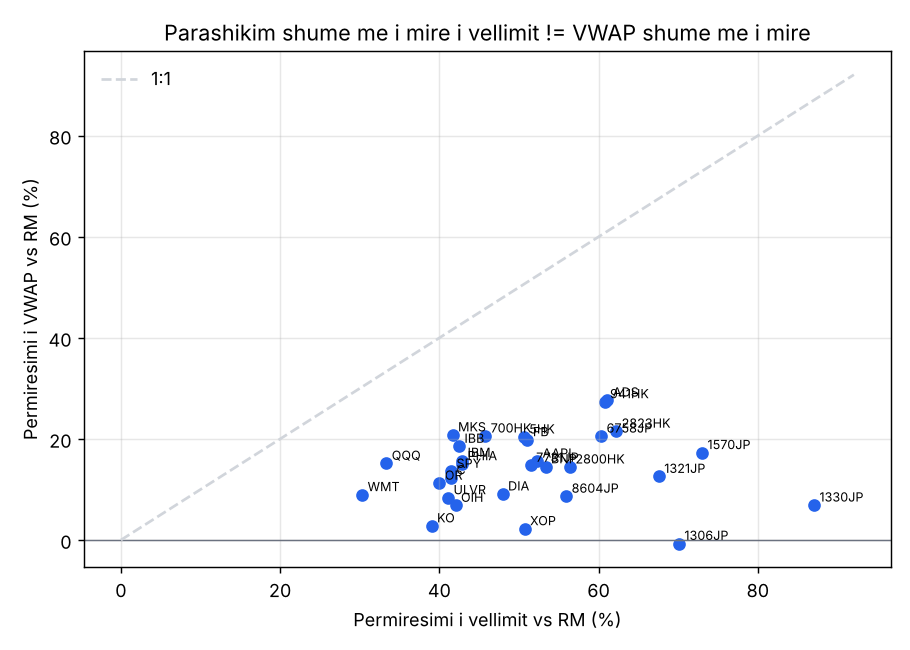

# Analiza: "Forecasting Intraday Trading Volume: A Kalman Filter Approach"

Chen, Feng & Palomar (HKUST), SSRN 3101695. Ky dokument analizon strategjinë dhe të dhënat e artikullit si hap i parë drejt ndërtimit të një roboti në RoboQuant.

- Të dhënat (tabelat 1–4 të artikullit): [`data/`](data/)
- Skripti që i rillogarit të gjitha numrat: [`analyze_paper_data.py`](analyze_paper_data.py) (`python3 analysis/analyze_paper_data.py`)
- Grafikët: [`figures/`](figures/)

Transkriptimi i tabelave është kontrolluar: mesataret e llogaritura nga CSV-të përputhen me rreshtin "Average" të artikullit brenda ±0.01 për të 14 kolonat.

---

## 1. Çfarë bën strategjia (shkurt)

**Kjo NUK është strategji që parashikon drejtimin e çmimit.** Është model që parashikon **sa vëllim do tregtohet** në çdo interval 15-minutësh. Përdoret për **ekzekutim VWAP**: një urdhër i madh ndahet në copa sipas vëllimit të pritshëm, që çmimi mesatar i blerjes të jetë sa më afër VWAP-it të ditës.

### Modeli

Log-vëllimi i intervalit *i* në ditën *t* ndahet në 4 pjesë:

```
y(t,i) = η(t)        komponenti ditor   (sa "e zënë" është dita sot)
       + φ(i)        sezonaliteti       (forma U: vëllim i lartë në hapje dhe mbyllje)
       + μ(t,i)      dinamika brenda ditës (p.sh. një orë më aktive se zakonisht vazhdon)
       + v(t,i)      zhurmë
```

- **Pse logaritmi:** vëllimi është shumë i shtrembër djathtas; log-vëllimi është afërsisht normal (Fig. 1 e artikullit), kështu modeli bëhet linear dhe pa kufizime pozitiviteti.
- **Filtri Kalman:** η dhe μ janë të fshehura. Filtri i vlerëson dhe i përditëson pas çdo intervali të ri (algoritmi 1). η ndryshon vetëm në fillim të ditës; μ ndryshon në çdo interval.
- **Kalibrimi EM:** parametrat (`a_η, a_μ, σ_η², σ_μ², r, φ₁…φ_I, π₁, Σ₁`) gjenden me formula të mbyllura (algoritmi 3). Konvergjon shpejt dhe nuk varet nga vlerat fillestare (Fig. 4 e artikullit).
- **Versioni robust (Lasso):** shton një term `z` për outliers të rrallë. Në hapin e korrigjimit, gabimi pritet me prag `λ / (2W)` (ek. 33–34), kështu që një spike i vetëm nuk e prish vlerësimin.
- **Dy mënyra parashikimi:**
  - *statik*: të gjitha intervalet e ditës nesër parashikohen sonte;
  - *dinamik*: çdo interval parashikohet duke përdorur edhe intervalet e mbyllura të sotme.

### Si testohet

- 30 tituj (12 ETF, 18 aksione), SHBA / Evropë / Azi, janar 2013 – qershor 2016, Bloomberg, intervale 15-min, pa ditët gjysmë-seance.
- Out-of-sample: qershor 2015 – qershor 2016 (D = 250 ditë), dritare rrotulluese.
- Cross-validation për gjatësinë e dritares N dhe λ: janar – maj 2015.
- Benchmark-et: **RM** (mesatarja e të njëjtit interval në N ditët e kaluara) dhe **CMEM** (Brownlees et al. 2011).
- Metrikat: MAPE e vëllimit dhe gabimi i ndjekjes së VWAP (bps).

---

## 2. Çfarë tregojnë të dhënat

### 2.1 Pretendimet kryesore vërtetohen, por mesatarja i zmadhon

| Krahasimi | Mesatarja (si artikulli) | **Mediana për titull** | Fiton në |
|---|---|---|---|
| Vëllim: RKF dinamik vs RM | 63.5% | **50.7%** | 30/30 |
| Vëllim: RKF dinamik vs CMEM dinamik | 28.6% | **15.9%** | 30/30 |
| Vëllim: RKF statik vs RM statik (krahasim i drejtë) | 51.6% | **29.1%** | 29/30 |
| VWAP: RKF dinamik vs RM | 14.7% | **14.6%** | 29/30 |
| VWAP: RKF dinamik vs CMEM dinamik | 9.0% | **9.8%** | 28/30 |

- Modeli fiton pothuajse kudo, kështu që rezultati është i qëndrueshëm.
- **64%-shi i artikullit krahason modelin dinamik me RM statik.** RM nuk ka version dinamik në tabelë, kështu që një pjesë e fitimit vjen thjesht nga përdorimi i informacionit brenda ditës. Krahasimi statik me statik jep 29% (mediana).
- Mesatarja e MAPE fryhet nga **6 tituj problematikë** (ETF japoneze/hongkongeze dhe MKS), ku devijimi standard i gabimit është 2–16 herë më i madh se mesatarja. Pa ta, MAPE mesatare e RKF dinamik bie nga 0.47 në 0.32. Mediana është 0.36.



### 2.2 Ku funksionon më mirë

| Grupi (mediana) | MAPE RKF dinamik | Përmirësimi i vëllimit vs RM | Përmirësimi VWAP vs RM |
|---|---|---|---|
| SHBA (12) | **0.24** | 45% | 15.7% |
| Evropë (6) | 0.41 | 45% | 13.1% |
| Azi (12) | 0.39 | 65% | 10.5% |
| Aksione (18) | 0.32 | 51% | **21.3%** |
| ETF (12) | 0.41 | 61% | 9.8% |

- Tregjet amerikane, likuide, kanë gabimin më të ulët (SPY: 0.24). Kjo ka rëndësi sepse ES/MES janë shumë afër SPY.
- **Ajo që e bën vëllimin të vështirë nuk është sa i madh është, por sa i shpërndarë.** Raporti Q95/Q5 korrelon me gabimin (Spearman ρ = 0.43, p = 0.018). Niveli i qarkullimit nuk korrelon (ρ = 0.13, p = 0.49).



### 2.3 Edhe në rastin më të mirë, gabimi për interval është ~24%

MAPE 0.24 për SPY do të thotë që parashikimi i një intervali 15-min gabon mesatarisht me ~24% të vëllimit real. **Vëllimi i një intervali të vetëm është shumë i zhurmshëm.** Si sinjal, vetëm devijimet e mëdha (p.sh. vëllim real > 1.5–2× parashikimi) mund të kenë kuptim.

### 2.4 Përditësimi brenda ditës ndihmon shumë vëllimin, pak VWAP-in

- Dinamik vs statik (RKF): MAPE e vëllimit bie **28%** (mediana), por gabimi VWAP bie vetëm **5.7%** (≈ 0.45 bps).

### 2.5 Versioni robust ka rëndësi vetëm kur ka outliers

- Në të dhëna të pastra, RKF dhe KF janë praktikisht identikë (20 barazime nga 30, diferenca mesatare +0.0003).
- Me outliers artificiale të mëdha (Tabela 1), rritja e MAPE dinamik është:
  - RKF: +13% deri +21%
  - KF standard: +26% deri +38%
  - RM: +52% deri +81%
- CMEM **dështon plotësisht** në 5 nga 12 skenarë.
- Të dhënat reale live (spike lajmesh, roll-e kontratash, gabime feed-i) janë pikërisht rasti ku duhet versioni robust.



### 2.6 Vlera ekonomike është e vogël në terma absolutë

- Kursimi VWAP i RKF dinamik vs RM: **1.10 bps mesatarisht, 0.90 bps mediana**. Mbi 1 bps vetëm në 14/30 tituj.
- SPY: 3.02 → 2.61 bps, pra **0.41 bps** kursim.
- Lidhja mes përmirësimit të vëllimit dhe atij VWAP është e dobët (ρ = 0.21, jo sinjifikative). **1% përmirësim në vëllim ≈ 0.29% përmirësim në VWAP.** Gabimi VWAP dominohet nga lëvizja e çmimit, jo nga parashikimi i vëllimit.
- RKF dinamik nuk është më i miri në VWAP për XOP, ULVR, 1306JP.



---

## 3. Kufizimet e artikullit

1. **Nuk ka sinjal fitimi.** Modeli nuk thotë asgjë për drejtimin e çmimit.
2. **Aksione/ETF, jo futures.** Robotët në RoboQuant tregtojnë futures CME (ES, MES, NQ…). Futures kanë:
   - seancë ~23-orëshe me vëllim shumë të ulët natën;
   - roll kontratash ku vëllimi kalon nga një kontratë te tjetra;
   - spike në 8:30 ET (CPI, NFP) dhe 14:00 ET (FOMC).
3. **Normalizimi me aksionet në qarkullim** nuk ekziston për futures. Duhet përdorur log(kontrata); komponenti η e thith nivelin gjithsesi.
4. **Periudha 2013–2016**, para regjimit të tregut pas 2020 (0DTE, rritja e MES/micro).
5. **Benchmark-u RM është i dobët** (vetëm statik). Krahasimi i drejtë jep fitime më të vogla se 64%.
6. **Supozimi i vëllimit jo-zero** për çdo interval. Në RTH për ES nuk është problem; natën mund të jetë.

---

## 4. Çfarë do të thotë për robotin

Sipas dokumentacionit të RoboQuant, `Bar` ka `volume`, ka orë ET (`et_hhmm()`, `et_date_num()`), `Rolling<f64>` dhe `ctx.log()`. Filtri Kalman me 2 gjendje është vetëm pak aritmetikë për bar, kështu që **mund të implementohet direkt në `.rq`**. Kalibrimi EM bëhet më mirë offline (Python), dhe parametrat kalojnë si `#[param]`. Sezonaliteti φ (26 vlera për RTH 15-min) mund të llogaritet brenda strategjisë si mesatare rrotulluese për çdo interval.

Tri mënyra për ta kthyer në robot:

| Opsioni | Ideja | Vlerësimi |
|---|---|---|
| **A. Filtër "volume surprise"** | Parashikohet vëllimi i intervalit; hyrja (p.sh. breakout NY ORB në MES 15m) bëhet vetëm kur vëllimi real > k × parashikimi | Më praktiku për futures retail. **Hipotezë e paprovuar**: artikulli nuk e teston. Duhet backtest. |
| **B. Ekzekutim VWAP** | Një pozicion i madh ndahet në copa sipas parashikimit | Saktësisht ajo që teston artikulli, por me 1–5 kontrata nuk ka çfarë të ndash. Ka kuptim vetëm me madhësi të madhe. |
| **C. Regjim / madhësi pozicioni** | Vëllimi i pritshëm i ditës (η) si proxy për volatilitetin: stop dhe madhësi adaptive | E arsyeshme, por edhe kjo është hipotezë. |

### Hapi tjetër i propozuar: të dhënat reale CME

Para se të shkruhet roboti, duhet verifikuar që vetitë e artikullit vlejnë për ES/MES:

1. Nxirren barët 15-min (koha, vëllimi) për ES/MES nga RoboQuant. MCP nuk ka shkarkim direkt të të dhënave, kështu që rruga është një strategji "sondë" pa tregti që bën `ctx.log()` për çdo bar, një backtest, dhe leximi i logjeve.
2. Kontrollohet në ES/MES:
   - Q-Q i log-vëllimit;
   - forma U në RTH;
   - autokorrelacioni brenda ditës;
   - efekti i roll-it dhe i ditëve me lajme.
3. Implementohet KF + EM (dhe versioni robust) në Python dhe krahasohet me RM out-of-sample në ES.
4. Vetëm pastaj shkruhet roboti `.rq` (opsioni i zgjedhur) dhe testohet në RoboQuant me kosto reale.
