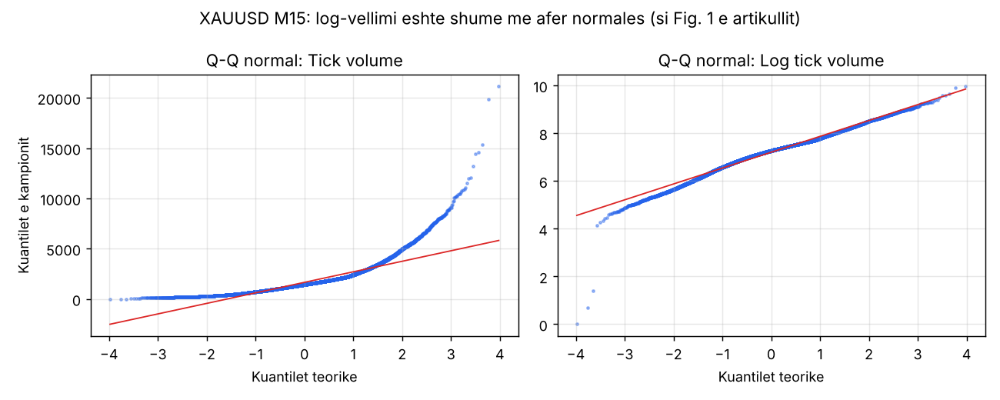
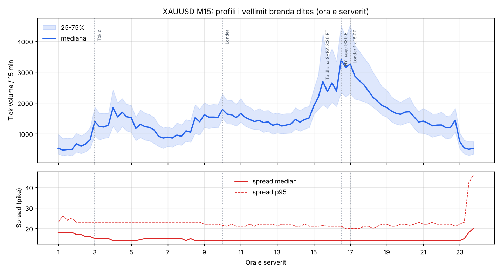
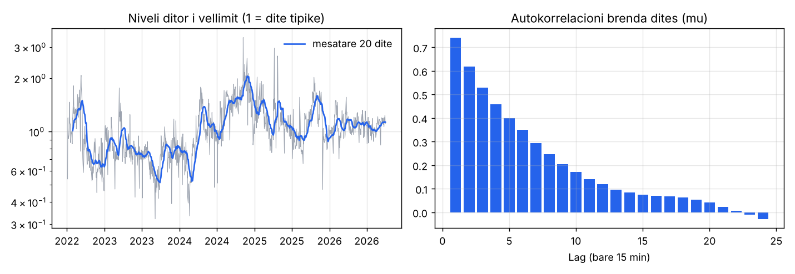
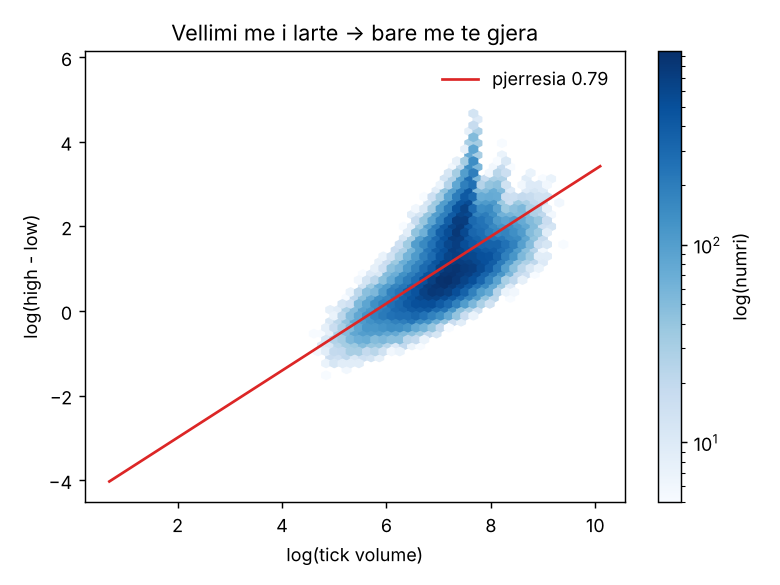
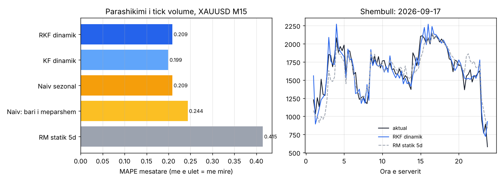
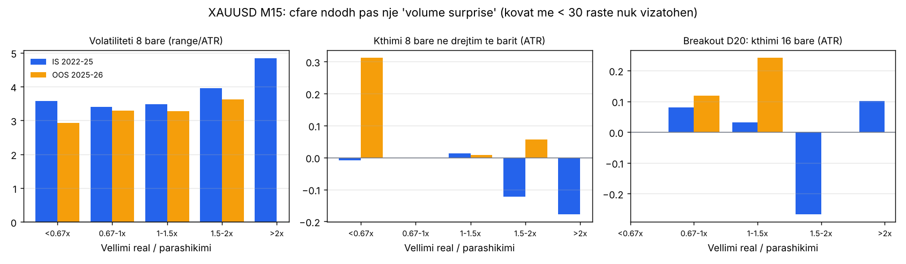
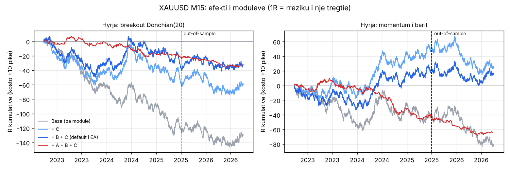

# XAUUSD: analiza e të dhënave dhe testi i EA-së Kalman

Ky raport zbaton modelin e artikullit (Chen, Feng & Palomar, SSRN 3101695) mbi të dhënat XAUUSD të eksportuara nga MT5. Pastaj teston nëse tre mënyrat e përdorimit (modulet A, B, C) japin avantazh tregtimi.

> **Përfundimi shkurt**
>
> - Modeli e parashikon tick volume-in e arit shumë mirë: gabimi është 50% më i vogël se metoda e artikullit (RM).
> - Por **asnjë kombinim modulesh nuk del fitimprurës në mënyrë të qëndrueshme** pas kostove, si in-sample (2022–2025) ashtu edhe out-of-sample (07.2025–09.2026).
> - Moduli **C** (regjimi i vëllimit) përmirëson të tri hyrjet bazë që testuam, si IS ashtu edhe OOS. Moduli **B** (hyrja e ndarë) ul kryesisht drawdown-in.
> - Moduli **A** (volume surprise) nuk jep drejtim. Si filtër breakout-i e përkeqëson rezultatin.
> - EA-ja është gati dhe i ka të treja modulet, por **nuk duhet përdorur me para reale** pa një sinjal hyrjeje me avantazh të provuar.

Çdo numër këtu rillogaritet me skriptet në repo. Daljet janë të ruajtura në [`results/`](results/).

| Hapi | Skripti | Dalja |
|---|---|---|
| Analiza e të dhënave | `analysis/xauusd_eda.py` | `results/xauusd_eda.txt` |
| Modeli walk-forward (4 vjet) | `model/walkforward.py` | `data/derived/m15_rkf.csv.gz`, `m15_kf.csv.gz` |
| Saktësia e parashikimit | `analysis/xauusd_model_eval.py` | `results/xauusd_model_eval.txt` |
| A ka sinjal "volume surprise"? | `analysis/xauusd_signal_research.py` | `results/xauusd_signal_research.txt` |
| Testi i moduleve A/B/C | `strategy/ablation.py` | `results/ablation_modules.txt` |
| Optimizim IS → kontroll OOS | `strategy/grid_is_oos.py` | `results/grid_is_oos.txt` |

---

## 1. Të dhënat

- **Skedarët:** M1, M5, M15, M30, D1 nga MT5. Analiza kryesore është në **M15**, sepse artikulli përdor intervale 15-minutëshe:
  - 100,279 bar-e;
  - 04.07.2022 – 01.10.2026;
  - 1,097 ditë.
- **Seanca:** 01:00–23:45 me orën e serverit (GMT+2/+3, NY 17:00 = 00:00). Kjo jep **92 bar-e në ditë** dhe 1,051 ditë janë të plota. Ditët e tjera janë mbyllje të hershme festash amerikane (21:15/21:30). Kjo përputhet saktë me rrjetin T × I të artikullit (I = 92).
- **Vëllimi:** kolona `VOL` është 0 kudo, kështu që përdoret **tick volume**. Për arin spot (CFD) kjo është e vetmja masë vëllimi.

### 1.1 Log-vëllimi është afërsisht normal

| | skew | kurtosis |
|---|---|---|
| Tick volume | +2.75 | +16.9 |
| Log tick volume | −0.61 | +2.4 |

Si në Fig. 1 të artikullit, logaritmi e bën shpërndarjen shumë më afër normales. Bishti i majtë mbetet: bar-e me vëllim shumë të ulët në festa, që i trajton versioni robust.

### 1.2 Sezonaliteti brenda ditës (φ)

- **Kulmi:** 16:30–17:30 me orën e serverit, pra hapja e NY 9:30 ET. Rreth 3,400 tick në 15 min.
- **Minimumi:** 01:15–01:45 dhe 23:30–23:45. Rreth 500 tick.
- **Raporti max/min:** 7.2×.
- Kulme më të vogla shihen në hapjen e Tokios (03:00), të Londrës (10:00) dhe te të dhënat amerikane 8:30 ET (15:30).
- **Spread:** mediana është 14 pikë gjithë ditën. Rritet në 20 pikë në 23:45, ku p95 arrin 46 pikë (rollover). Prandaj EA-ja mbyll gjithçka në 23:30.

### 1.3 Komponenti ditor (η) dhe dinamika brenda ditës (μ)

- **Niveli ditor është shumë i qëndrueshëm:** autokorrelacioni është 0.86 pas 1 dite dhe 0.53 pas 20 ditësh. Kjo justifikon komponentin η.
- **Pas heqjes së nivelit ditor dhe sezonalitetit**, mbetja ka autokorrelacion 0.74, 0.62, 0.46, 0.25, 0.07 për lag 1, 2, 4, 8, 16 bar-e. Ky është komponenti AR(1) μ, me a_μ ≈ 0.85.
- **Varianca e log-vëllimit ndahet kështu:**
  - sezonaliteti: 42%;
  - niveli ditor: 25%;
  - mbetja brenda ditës: 30%.

  Të tre komponentët e modelit kanë peshë.
- **Dita e javës nuk ka efekt:** 0.98–1.01.

### 1.4 Vëllimi dhe volatiliteti

- **Lidhja:** `log(high−low) = −4.58 + 0.79·log(tick volume)`, R² = 0.37.
- **Kuptimi:** bar-et me më shumë tick janë më të gjera. Për tick volume kjo është pjesërisht mekanike, sepse tick = ndryshim kuotimi.
- **Pse ka rëndësi:** është arsyeja pse moduli C funksionon. Parashikimi i vëllimit është në thelb parashikim volatiliteti.

### 1.5 Kujdes: ndryshim në feed-in e broker-it në 2026

| Viti | std e gabimit log | r (zhurma) | bar-e > 1.5× parashikimi | bar-e me z > 2 |
|---|---|---|---|---|
| 2022 | 0.27 | 0.016 | 5.4% | 4.0% |
| 2023 | 0.26 | 0.017 | 4.8% | 3.6% |
| 2024 | 0.28 | 0.017 | 5.6% | 4.0% |
| 2025 | 0.23 | 0.011 | 3.2% | 3.4% |
| 2026 | **0.12** | **0.003** | **0.6%** | 3.1% |

- **Çfarë ndodhi:** në 2026 tick volume u bë shumë më i "lëmuar". Me shumë gjasë broker-i ka ndryshuar mënyrën si i numëron tick-et.
- **Pasoja:** një prag fiks si "vëllim > 1.5× parashikimi" pothuajse nuk aktivizohet më.
- **Zgjidhja në EA:** moduli A punon në **njësi sigma** (z = log(real/parashikim)/√S), që mbetet e qëndrueshme rreth 3–4% çdo vit.
- **Për live:** nëse broker-i live ndryshon nga ai i testit, pragjet duhen kontrolluar.

---

## 2. Sa mirë parashikon modeli?

### Metoda

- **Walk-forward:** çdo ditë modeli rifitohet (EM) me 60 ditët e mëparshme, pastaj filtrohet bar pas bari. Kjo është saktësisht ajo që bën EA-ja.
- **Periudha:** 26.09.2022 – 30.09.2026, 94,768 bar-e.

| Modeli | MAPE mesatare | MAPE mediane |
|---|---|---|
| **Robust Kalman (RKF) dinamik** | 0.209 | **0.114** |
| Kalman standard dinamik | **0.199** | 0.115 |
| RM statik 5 ditë (benchmark-u më i mirë i artikullit) | 0.415 | 0.185 |
| RM statik 20 ditë | 0.436 | 0.199 |
| Naiv: vëllimi i bar-it të mëparshëm | 0.244 | 0.145 |
| Naiv sezonal: bar-i i mëparshëm × profili | 0.209 | 0.123 |

- **RKF dinamik vs RM: −50%** (artikulli: −64%). Kjo përputhet me medianën 51% që gjetëm te tabelat e artikullit.
- **Kundër një benchmark-u dinamik naiv sezonal, avantazhi zhduket:**
  - mesatarja: 0.209 kundrejt 0.209;
  - mediana: 0.114 kundrejt 0.123 (−7%).

  Artikulli nuk e ka këtë krahasim. Për parashikimin një bar përpara, pjesën më të madhe të punës e bën sezonaliteti + bar-i i fundit.
- **Versioni robust është 4.6% më keq se Kalman-i standard në MAPE mesatare.** Te ari, surprizat e mëdha shpesh vazhdojnë (lajme), dhe prerja i vonon përshtatjes. Robust-i preu 1.7% të bar-eve.
- **Gabimi është i kalibruar mirë:** std e z-score është 1.05–1.18 (ideali 1.0). Këtë e përdorin modulet A dhe B.

---

## 3. A ka "volume surprise" informacion për çmimin?

### Metoda

- Për çdo bar M15 nga 09:00 deri 20:00, surprise = vëllimi real / parashikimi i bërë **para** bar-it.
- **In-sample (IS):** para 01.07.2025. **Out-of-sample (OOS):** pas kësaj date.
- Kthimet maten në ATR. Tabelat e plota janë te `results/xauusd_signal_research.txt`.

| Pyetja | IS | OOS | Përfundimi |
|---|---|---|---|
| Surprise e lartë → volatilitet më i lartë 8 bar-e më pas? | 3.40 → 3.96 → 4.84 ATR (normal → 1.5–2× → >2×) | 3.30 → 3.62 | **Po.** Baza e modulit C. |
| Pas bar-it me surprise të lartë, çmimi vazhdon në drejtimin e bar-it? | −0.12 / −0.18 ATR (t ≈ −1.2 / −0.6) | ≈ 0 | **Jo.** Ka vetëm një tendencë të dobët kthimi, jo sinjifikative. |
| Breakout Donchian(20) me surprise të lartë është më i mirë? | 1.5–2×: −0.27 ATR pas 16 bar-esh (t −1.25) | −0.52 | **Jo, më keq.** Breakout-et me vëllim normal (1–1.5×) dalin më mirë: OOS +0.24 ATR, t 2.6. |
| Aktiviteti i ditës (η) ndikon te breakout-i? | Pa model të qëndrueshëm | Pa model të qëndrueshëm | Jo si filtër. |

---

## 4. Testi i moduleve në EA

### Rregullat bazë

| Element | Vlera |
|---|---|
| Sinjali | Në mbyllje të bar-it M15, 09:00–20:00 me orën e serverit |
| Stop loss | 1.5 × ATR(14) |
| Take profit | 2R |
| Mbyllje me kohë | Pas 16 bar-esh, ose në 23:30 |
| Tregti në ditë | Max 2 |
| Çmimet | Ask/bid realë nga kolona `SPREAD` |

Rezultatet janë në **R** (1R = rreziku i një tregtie), me **+10 pikë kosto shtesë** për tregti (komision/slippage). Skripti `strategy/backtest.py` pasqyron rregullat e EA-së.

| Hyrja | Modulet | IS: tregti | IS: PF | IS: total R | OOS: tregti | OOS: PF | OOS: total R |
|---|---|---|---|---|---|---|---|
| Donchian(20) | asnjë | 1370 | 0.86 | −121.8 | 614 | 0.98 | −8.0 |
| Donchian(20) | C | 1362 | 0.93 | −58.3 | 604 | 1.00 | −1.1 |
| Donchian(20) | **B + C** | 1362 | 0.95 | −37.2 | 604 | **1.02** | **+4.5** |
| Donchian(20) | A | 259 | 0.84 | −26.1 | 79 | 0.72 | −14.1 |
| Donchian(20) | A + B + C | 257 | 0.84 | −21.6 | 79 | 0.68 | −11.4 |
| Momentum | asnjë | 1422 | 0.96 | −40.1 | 648 | 0.89 | −42.1 |
| Momentum | **C** | 1422 | **1.06** | **+52.2** | 648 | 0.93 | −27.8 |
| Momentum | B + C | 1422 | 1.03 | +22.7 | 648 | 0.98 | −6.8 |
| Fade | asnjë | 1422 | 0.82 | −169.4 | 648 | 0.94 | −22.4 |
| Fade | **A + B** | 417 | **1.13** | +23.1 | 133 | 0.95 | −3.1 |

### Çfarë tregon tabela

- **Moduli C përmirëson të tri hyrjet bazë,** si në IS ashtu edhe në OOS. Win rate rritet me 3–5 pikë në IS dhe 1–1.5 në OOS. Kombinuar me A, efekti në OOS është i përzier. Stop-i përshtatet sipas vëllimit të pritshëm në orët e ardhshme. P.sh. në hapjen e Londrës pas Azisë së qetë, ATR-ja është e vogël por vëllimi i pritshëm rritet, kështu që stop-i zgjerohet.
- **Moduli B ul drawdown-in në OOS** te të tri hyrjet, sepse çmimi i hyrjes mesatarizohet:
  - Donchian: 36 → 25 R;
  - Momentum: 56 → 31 R;
  - Fade: 37 → 33 R.

  Efekti në rezultat është i përzier.
- **Moduli A si filtër vazhdimi dëmton gjithmonë.** Si "fade" (kundër bar-it me vëllim ekstrem) ka PF 1.13 në IS, por **humb në OOS**.
- **Kombinimi i plotë A + B + C nuk ndihmon.** A i heq tregtitë që C dhe B i përmirësojnë.

### 4.1 Optimizim vetëm në IS, kontroll në OOS

Për tre familjet më premtuese, 162–243 kombinime parametrash u zgjodhën sipas t-stat në IS. OOS nuk u përdor fare për zgjedhje.

| Familja | Kombinime me total R > 0 (IS) | Më e mira në IS: PF | E njëjta në OOS: PF | OOS: total R |
|---|---|---|---|---|
| Donchian + B + C | 1% | 1.00 | 0.83 | −58.8 |
| Momentum + C | 17% | 1.07 | 0.97 | −11.5 |
| Fade + A + B | 29% | 1.23 | 0.79 | −10.8 |

**Optimizimi nuk gjen avantazh që mbijeton jashtë kampionit.** Kjo është shenja klasike e overfitting-ut. Prandaj vlerat default të EA-së **nuk janë të optimizuara**: janë vlerat fikse të testit të moduleve më sipër.

---

## 5. Si t'i lexojmë këto rezultate

1. **Artikulli zbatohet mirë te ari, por është mjet ekzekutimi dhe rreziku, jo sinjal fitimi.** E njëjta gjë që thamë për artikullin, tani e konfirmuar me të dhënat e tua.
2. **C (dhe deri diku B) janë të dobishëm si menaxhim rreziku.** Mund të vendosen mbi një sinjal hyrjeje që ka avantazh të vetin.
3. **Sinjali i hyrjes është problemi.** Breakout-i, momentum-i dhe fade-i i thjeshtë nuk kanë avantazh në XAUUSD M15 pas kostove.
4. **Ka kufizime të backtest-it:**
   - nuk ka slippage të vërtetë;
   - SL/TP në të njëjtin bar supozohen gjithmonë SL;
   - modeli i ekzekutimit të B është i thjeshtuar (pa min-lot);
   - në 2026 tick volume ndryshon karakter.

   Testi përfundimtar duhet bërë në **MT5 Strategy Tester me "Every tick based on real ticks"**.

## 6. Hapat e mëtejshëm të propozuar

- **Test në MT5:** testo EA-në me broker-in tënd. Krahaso numrin e tregtive dhe PF me tabelën e seksionit 4. Duhet të jenë afër për Donchian + B + C.
- **Sinjal më i mirë hyrjeje:** zëvendëso sinjalin bazë me një hyrje që ka avantazh të provuar, dhe mbaj B + C si menaxhim rreziku.
- **Volatilitet, jo drejtim:** përdor modelin si filtër volatiliteti, p.sh. mos tregto në bar-e me vëllim të pritshëm shumë të ulët. Kjo kërkon testin e vet.

## 7. Testi në MT5 Strategy Tester dhe krahasimi me Python

### Testet

Dy teste me EA v1.00:

| Fusha | Vlera |
|---|---|
| Llogaria | FP Markets demo, hedge |
| Simboli | XAUUSD |
| Periudha | 01.01.2026 – 01.10.2026 |
| Modelimi | Real ticks |
| Kapitali | 10,000 USD |
| Parametrat | Default |

Krahasimi me të njëjtat rregulla në Python (`strategy/compare_mt5.py`, dalja në `results/mt5_vs_python_2026.txt`):

| | Pozicione | PF | Equity | Max DD |
|---|---|---|---|---|
| **MT5 M15 (v1.00)** | ~1000 | 0.88 | −16.2% | 22.4% |
| Python M15, si v1.00, kosto 7 | 1028 | 0.92 | −15.4% | 21.6 R |
| Python M15, **v1.01**, kosto 7 | 974 | 0.95 | −10.9% | 19.3 R |
| **MT5 M15 (v1.01)** | ~956 | 0.90 | −14.1% | 21.1% |
| Python M15, v1.01, kosto 22 | 974 | 0.93 | −13.9% | 20.4 R |
| **MT5 M5 (v1.00)** | ~1121 | 0.96 | −6.8% | 25.5% |
| Python M5, si v1.00, kosto 7 | 1123 | 0.95 | −11.1% | 31.1 R |
| Python M5, **v1.01**, kosto 7 | 1097 | 0.98 | −6.3% | 29.1 R |

### Gabimi i gjetur në EA v1.00

- **Çfarë ndodhte:** me modulin B, pasi SL/TP mbyllte pozicionin, copat e mbetura nuk anuloheshin. Nëse çmimi kthehej brenda SL–TP, EA rihynte në një tregti që kishte dështuar tashmë.
- **Prova:** kur ky gabim simulohet në Python, numri i pozicioneve përputhet me MT5 (M5: 1123 kundrejt 1121) dhe rezultati M15 afrohet shumë (−15.4% kundrejt −16.2%).
- **Rregullimi:** EA **v1.01** anulon copat e mbetura sapo pozicioni i sinjalit mbyllet.

### Testi me v1.01 në MT5

- **Rregullimi u konfirmua:** pozicionet ranë nga ~1000 në ~956, dhe rezultati u përmirësua nga −16.2% në −14.1%.
- **Diferenca që mbetet me Python-in shpjegohet nga kostoja e ekzekutimit.** Python-i e përsërit rezultatin e MT5 kur kostoja totale për tregti është **~22 pikë** (komision + spread real në tick + slippage në SL), jo 7. Spread-i në bar-et e eksportuara nënvlerëson spread-in real në momentin e ekzekutimit.
- **EA-ja dhe backtest-i janë të njëjta.** Kosto reale për tregti është rreth 0.22 $/oz. Ky numër duhet përdorur për çdo strategji tjetër që testojmë.

### Çfarë pritet nga v1.01

- **Për 2026:** rreth −11% në M15 dhe −6% në M5 (me ~7 pikë kosto). **Edhe pa gabimin, strategjia humb në 2026.**
- **Modulet në 2026:**
  - në M5, C dhe B i ulin humbjet: −22.6R pa module → −4.2R me B + C;
  - në M15 2026 nuk ndihmojnë: −6.8R pa module, −9.5R me B + C.

  Një arsye e mundshme është ndryshimi i feed-it të tick volume në 2026 (seksioni 1.5).
- **Z-score rreth −20 në MT5** vjen nga moduli B: disa pozicione për sinjal mbyllen bashkë me të njëjtin rezultat. Nuk është problem.
